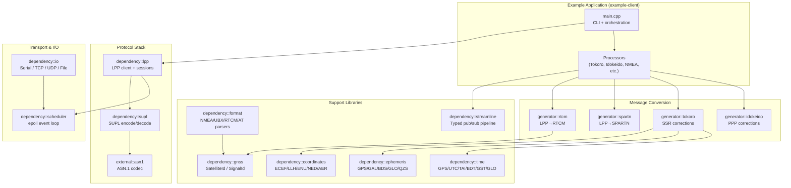
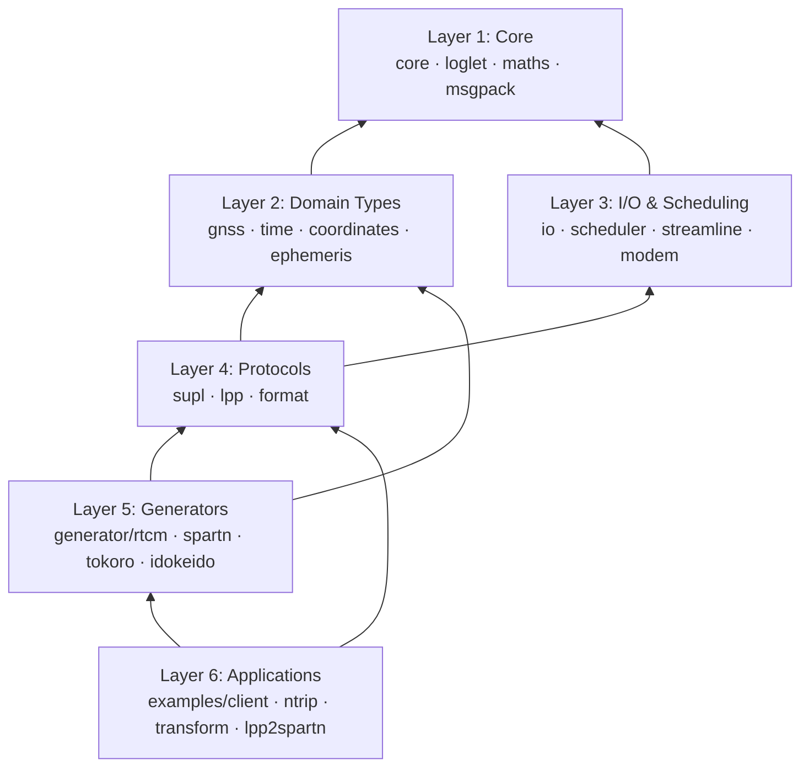
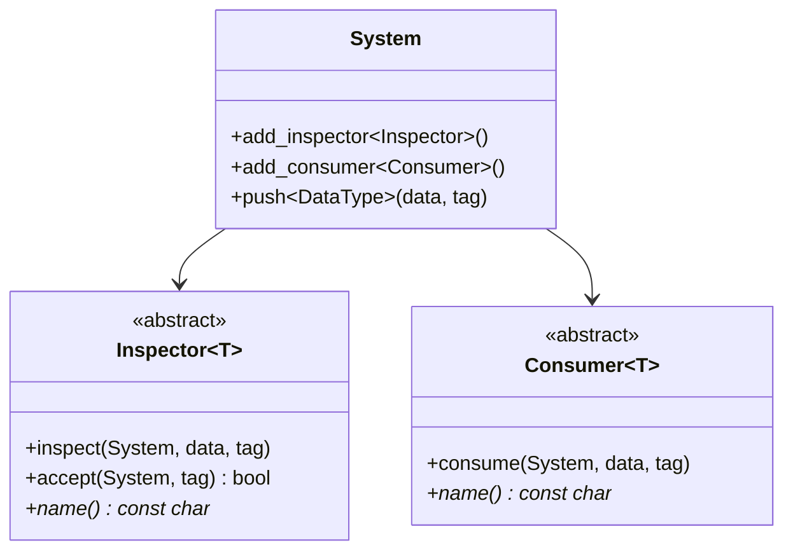
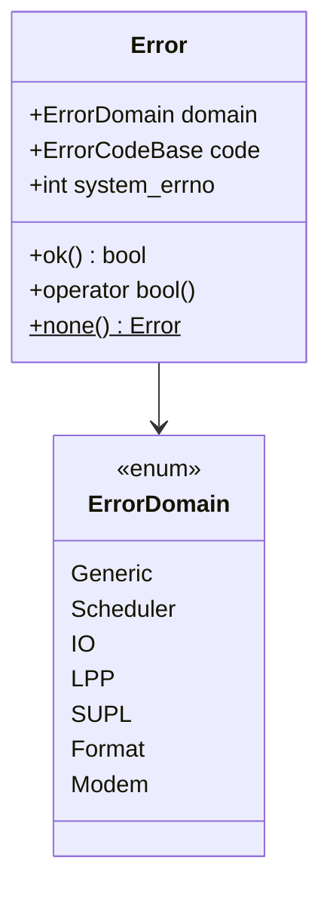
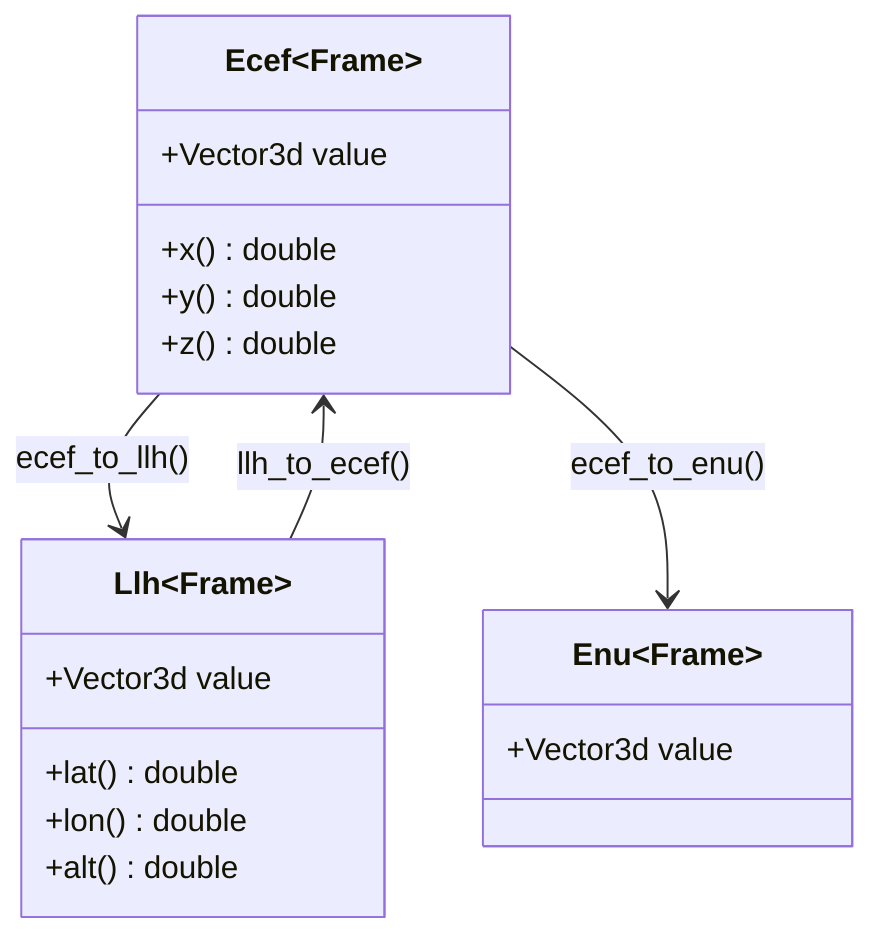
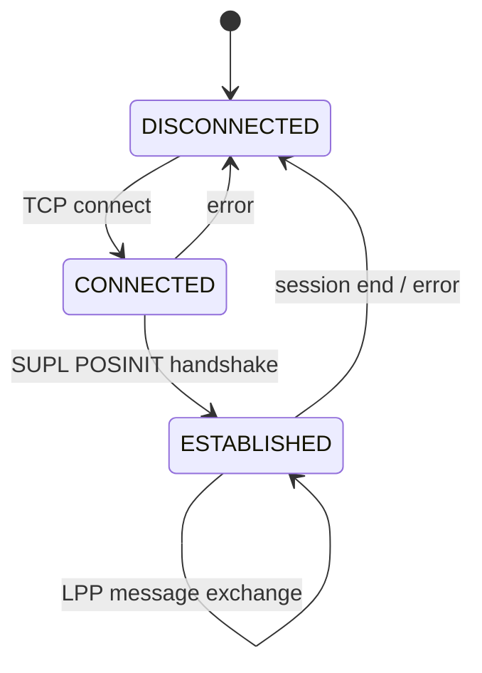

# Architecture

## System Overview

SUPL-3GPP-LPP-client is a C++ toolkit that implements a 3GPP LPP client. It connects to a SUPL server over TCP/TLS, exchanges LPP messages to obtain GNSS assistance data, and can convert that data to RTCM or SPARTN correction formats for downstream GNSS receivers.



## Layered Architecture



## Key Design Patterns

### Streamline Pipeline (Pub/Sub)

The `streamline::System` is a type-indexed publish/subscribe bus backed by the scheduler's event loop. Components register as `Inspector<T>` (read-only) or `Consumer<T>` (exclusive). Producers call `system.push(data, tag)`.



### Error Handling

All fallible operations return `Error` or `Result<T>`. No exceptions are thrown.



### Coordinate System (Type-Safe Frames)

Coordinate types are parameterized by a `Frame` type that carries ellipsoid data, preventing accidental mixing of reference frames at compile time.



### LPP Session State Machine



## CMake Module Pattern

Every dependency follows this pattern:

```cmake
add_library(dependency_<name> STATIC <sources>)
add_library(dependency::<name> ALIAS dependency_<name>)
target_include_directories(dependency_<name> PUBLIC include/)
target_link_libraries(dependency_<name> PUBLIC <deps>)
setup_target(dependency_<name>)
```

`setup_target()` (defined in `cmake/target.cmake`) applies consistent compiler flags, warnings, and optional static analysis.
