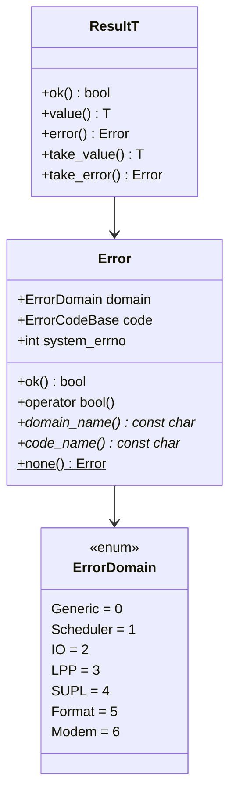
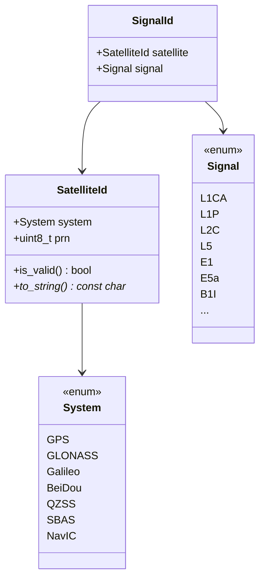
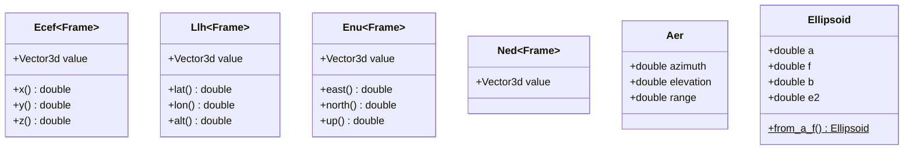
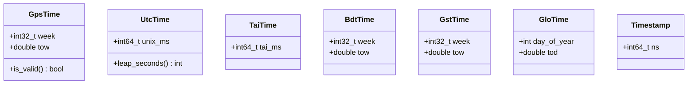
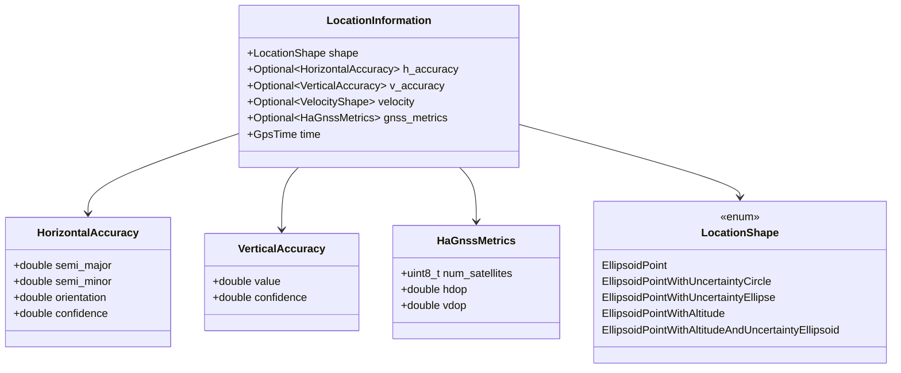
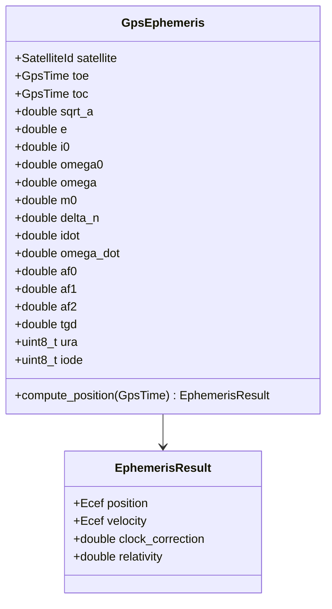
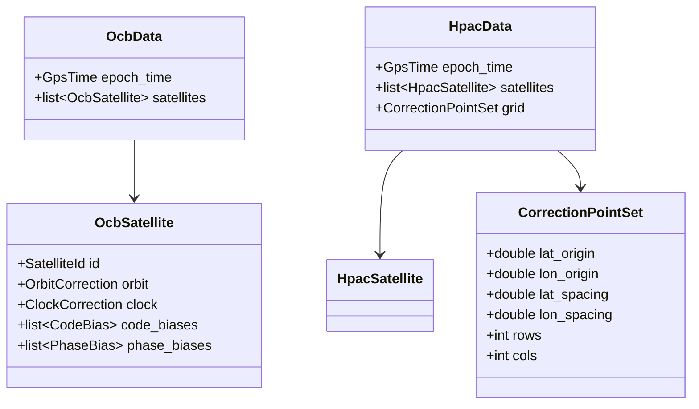

# Data Models

## Error Types

## GNSS Types

## Coordinate Types

## Time Types

## LPP Location Information

## Ephemeris Types

## RTCM Data Types (format/rtcm)

The RTCM parser uses strongly-typed data fields defined in `datatypes.hpp`:

- `df_uint<N>` — unsigned N-bit field
- `df_int<N>` — signed N-bit field
- `df_intS<N>` — signed scaled integer
- `df_bit` — single bit flag

These wrap raw integer values with type safety to prevent accidental mixing of RTCM data fields.

## SPARTN Data Structures (generator/spartn)

## MessagePack Serialization

Used for test data and Tokoro snapshots. The `msgpack` module provides:

- `MsgpackWriter` — sequential write of typed values (uint8, uint16, uint32, uint64, float, double, bytes)
- `MsgpackReader` — sequential read with type checking
- `MsgpackVector` — vector serialization helper

Test data files are stored in `tests/data/` (GPS, GAL, BDS, GLO, QZSS ephemeris in MessagePack format).
