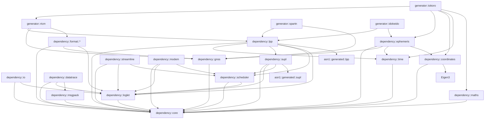

# Dependencies

## External Dependencies

### Eigen3

- **Source**: Fetched via CPM (CMake Package Manager) at configure time
- **Config**: `external/eigen3.cmake`
- **Usage**: Linear algebra (Vector3d, Matrix3d) in `coordinates`, `ephemeris`, `generator/tokoro`
- **Version**: Latest compatible with C++11/20

### args (taywee/args)

- **Source**: Vendored in `external/args/include/args.hxx`
- **Config**: `external/args.cmake`, `external/args/CMakeLists.txt`
- **Usage**: CLI argument parsing in all example applications
- **License**: MIT

### ASN.1 Codec (asn1c-generated)

- **Source**: Vendored in `external/asn.1/`
- **Config**: `external/asn.1/CMakeLists.txt`
- **Targets**:
  - `asn1::generated::lpp` — LPP ASN.1 generated C code (`lpp_generated/`)
  - `asn1::generated::supl` — SUPL ASN.1 generated C code (`supl_generated/`)
  - `asn1::skeleton` — asn1c runtime skeleton (`skeleton/`)
  - `asn1::helper` — helper utilities (`helper/`)
  - `asn1::generated::fugou` — additional generated code (`fugou_generated/`)
- **License**: BSD (asn1c)

### OpenSSL / libssl

- **Source**: System package (`libssl-dev`)
- **Usage**: TLS for SUPL TCP connections in `dependency/supl/tcp_client.cpp`
- **Install**: `sudo apt install libssl-dev`

## System Dependencies

| Dependency | Purpose | Install |
|-----------|---------|---------|
| `g++` / `clang++` | C++ compiler | `sudo apt install g++` |
| `cmake` 3.14+ | Build system | `sudo apt install cmake` |
| `ninja-build` | Build backend | `sudo apt install ninja-build` |
| `libssl-dev` | TLS support | `sudo apt install libssl-dev` |
| `clang` + libFuzzer | Fuzzing (optional) | `sudo apt install clang` |

## Internal Dependency Graph

## Optional Feature Dependencies

| Feature | Required Modules | CMake Flag |
|---------|-----------------|-----------|
| RTCM generation | `generator::rtcm` | `INCLUDE_GENERATOR_RTCM=ON` |
| SPARTN generation | `generator::spartn` | `INCLUDE_GENERATOR_SPARTN=ON` |
| Tokoro OSR | `generator::tokoro` + RTCM | `INCLUDE_GENERATOR_TOKORO=ON` |
| Idokeido PPP | `generator::idokeido` | `INCLUDE_GENERATOR_IDOKEIDO=ON` |
| RINEX output | `format::rinex` + RTCM | `INCLUDE_FORMAT_RINEX=ON` |
| ANTEX parsing | `format::antex` + RTCM | `INCLUDE_FORMAT_ANTEX=ON` |
| Data tracing | `datatrace` | `DATA_TRACING=ON` |

## Cross-Compilation Toolchains

Toolchain files in `cmake/`:

| File | Target |
|------|--------|
| `toolchain-arm.cmake` | Generic ARM |
| `toolchain-aarch64.cmake` | AArch64 |
| `toolchain-rpi-armv6.cmake` | Raspberry Pi ARMv6 |
| `toolchain-rpi-aarch64.cmake` | Raspberry Pi AArch64 |
| `toolchain-beaglebone.cmake` | BeagleBone |

Docker images for cross-compilation are in `docker/linux/`.
