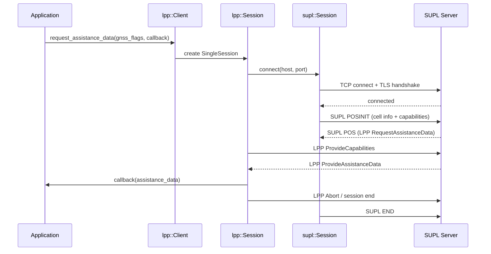
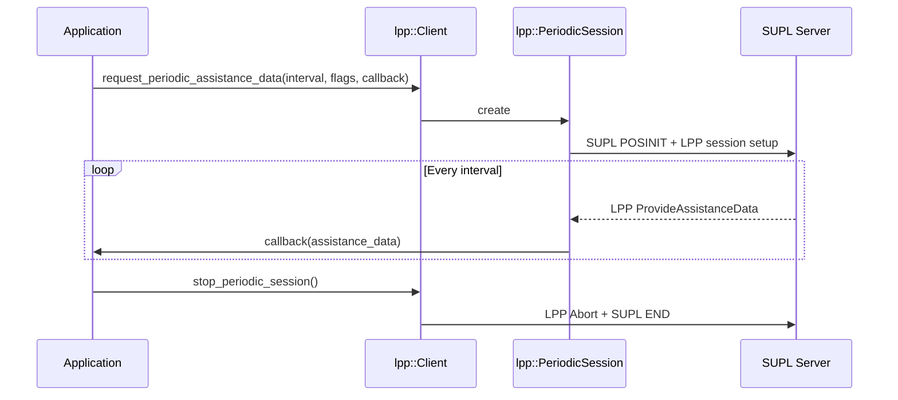
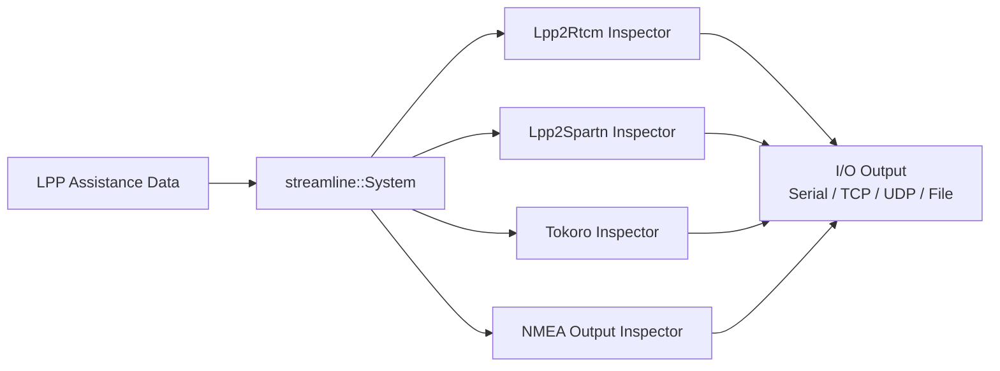
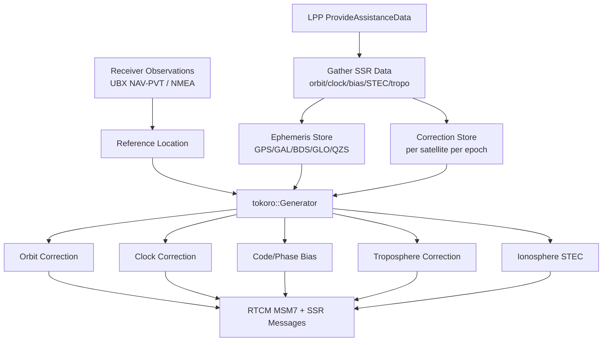
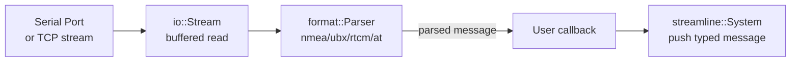
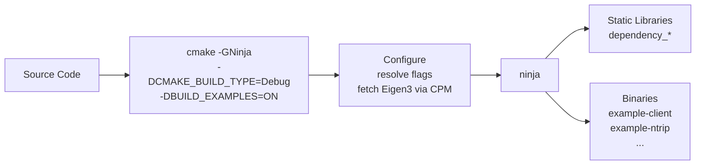
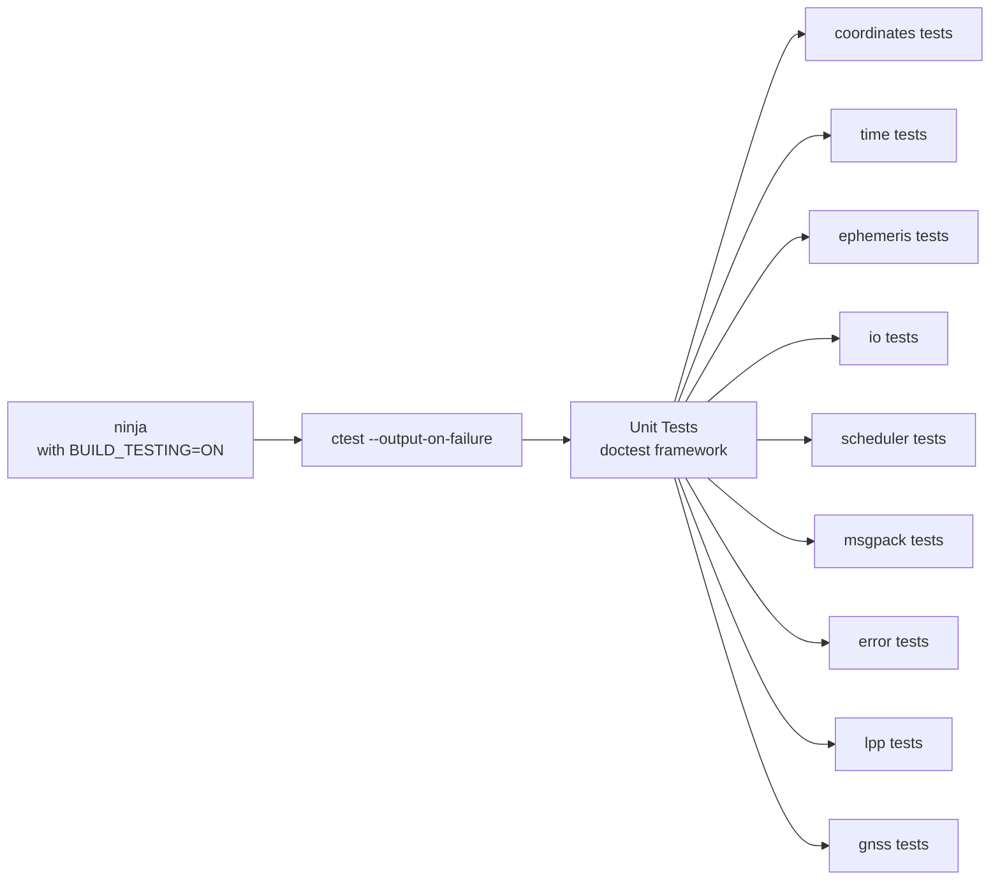
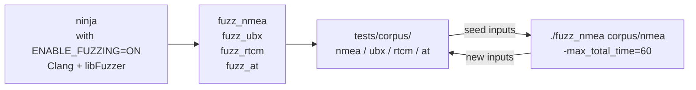

# Workflows

## 1. LPP Assistance Data Request (Single Session)



## 2. Periodic Assistance Data Delivery



## 3. LPP → RTCM Conversion Pipeline (example-client)



## 4. Tokoro SSR→OSR Correction Generation



## 5. example-client Startup Sequence

```mermaid
flowchart TD
    Start[main()] --> ParseCLI[Parse CLI args\nargs.hxx]
    ParseCLI --> CreateScheduler[Create Scheduler]
    CreateScheduler --> SetupIO[Setup I/O endpoints\nserial/TCP/UDP/file]
    SetupIO --> CreateStreamline[Create streamline::System]
    CreateStreamline --> AddProcessors[Add Processors\nbased on config flags]
    AddProcessors --> CreateLPP[Create lpp::Client]
    CreateLPP --> ConnectSUPL[Connect to SUPL server]
    ConnectSUPL --> RunLoop[scheduler.run()\nevent loop]
    RunLoop --> |LPP data arrives| Pipeline[Push to streamline pipeline]
    Pipeline --> |processed| Output[Write to configured outputs]
```

## 6. Format Parser Data Flow



## 7. Build Workflow



## 8. Test Execution



## 9. Fuzzing Workflow


