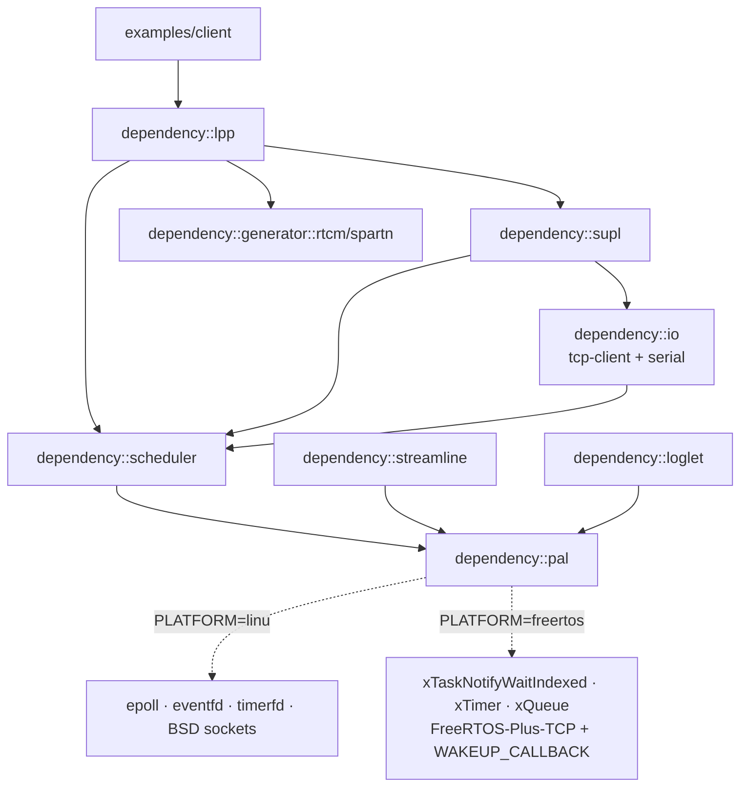

# FreeRTOS Port Plan

**Status:** 🟢 TODO
**Priority:** High
**Target:** FreeRTOS Kernel V10.5.1 + FreeRTOS-Plus-TCP V3.x
**Last Updated:** 2026-04-24

## 1. Goal

Port the LPP/SUPL protocol stack, LPP→RTCM/SPARTN converters, and a trimmed `example-client` to run on an MPU-class target running FreeRTOS (similar to a cellular-modem application processor). Networking through FreeRTOS-Plus-TCP. Heap allowed (heap_4/heap_5). TLS deferred. File I/O, TCP/UDP servers, PTY, Tokoro/Idokeido/RINEX/ANTEX, fuzzing, and on-target unit tests are out of scope.

## 2. Scope

### 2.1 In Scope

| Module | Notes |
|---|---|
| `dependency/core` | Drop `std::filesystem` usage on FreeRTOS (see §3.6) |
| `dependency/time` | Already portable |
| `dependency/coordinates` | Already portable |
| `dependency/gnss` | Already portable |
| `dependency/ephemeris` | Already portable |
| `dependency/maths` | Already portable |
| `dependency/msgpack` | Already portable |
| `dependency/format/lpp` | Already portable |
| `dependency/format/rtcm` | Already portable |
| `dependency/generator/rtcm` | Already portable |
| `dependency/generator/spartn` | Already portable |
| `dependency/lpp` | Already portable |
| `dependency/supl` | TLS disabled (`USE_OPENSSL=OFF`); `tls.cpp` no-op backend |
| `dependency/streamline` | `EventQueue` re-backed by PAL (see §3.4) |
| `dependency/loglet` | Sink routed through PAL (see §3.5) |
| `dependency/scheduler` | Rewritten on PAL event-loop primitives |
| `dependency/io` | TCP client + serial only |
| `examples/client` | Trimmed: hard-coded config, no CLI |
| `dependency/pal` **(new)** | Platform abstraction layer |

### 2.2 Out of Scope (FreeRTOS build)

- `dependency/format/rinex`, `dependency/format/antex`
- `dependency/generator/tokoro`, `dependency/generator/idokeido`
- `dependency/datatrace`
- `dependency/modem` (AT-driver — may revisit once a FreeRTOS serial driver exists)
- TCP/UDP servers, PTY streams, stdin/stdout streams, file I/O streams
- Examples: `transform`, `ntrip`, `lpp2spartn`, `modem_ctrl`, `ctrl_toggle`, `crs`
- Fuzzing targets, unit tests (`BUILD_TESTING=OFF`)
- TLS (OpenSSL; mbedTLS integration to be addressed in a future plan)

## 3. Current-State Analysis

The following code is Linux/POSIX-coupled and must be abstracted.

### 3.1 Scheduler (epoll/eventfd/timerfd)

- `dependency/scheduler/include/scheduler/scheduler.hpp:9` — `#include <sys/epoll.h>`
- `dependency/scheduler/include/scheduler/scheduler.hpp:69-119` — `class Scheduler` with `struct epoll_event mEvents[32]` member
- `dependency/scheduler/include/scheduler/scheduler.hpp:43-58` — `struct ScheduledEvent` — already handle-based, PAL-ready
- `dependency/scheduler/include/scheduler/scheduler.hpp:60-67` — `struct EventSlot` — static pool, PAL-ready
- `dependency/scheduler/scheduler.cpp:6` — `#include <sys/eventfd.h>`
- `dependency/scheduler/scheduler.cpp:43` — `::epoll_create1(0)`
- `dependency/scheduler/scheduler.cpp:50` — `::eventfd(0, EFD_NONBLOCK)`
- `dependency/scheduler/scheduler.cpp` — `epoll_wait`, `epoll_ctl`, `close`, `read/write` on fds
- `dependency/scheduler/timeout.cpp:5` — `#include <sys/timerfd.h>`
- `dependency/scheduler/timeout.cpp:24` — `::timerfd_create(CLOCK_MONOTONIC, TFD_NONBLOCK)`
- `dependency/scheduler/epoll_constants.hpp` — `EPOLL_IN`/`EPOLL_OUT`/etc. macros derived from `<sys/epoll.h>`

### 3.2 Scheduler public API leaks OS types

- `dependency/scheduler/include/scheduler/timeout.hpp:22` — `Timer::fd() const` returns `int`
- `dependency/scheduler/include/scheduler/socket.hpp:12` — `#include <sys/socket.h>`
- `dependency/scheduler/include/scheduler/socket.hpp:16-19` — `ListenerTask` takes `struct sockaddr_storage*`
- `dependency/scheduler/include/scheduler/socket.hpp:145-200` — `TcpConnectTask` exposes `int fd()` and `struct sockaddr_storage mAddress`
- `dependency/scheduler/include/scheduler/stream.hpp` — `StreamTask::fd()`, pipe fds

### 3.3 IO (BSD sockets, termios, file I/O)

- `dependency/io/tcp.cpp` — `socket()`, `connect()`, `getaddrinfo()`, `recv()`, `send()`
- `dependency/io/udp.cpp` — BSD sockets
- `dependency/io/serial.cpp` — `<termios.h>`, POSIX file ops
- `dependency/io/file.cpp`, `dependency/io/stream/file.cpp` — POSIX file I/O
- `dependency/io/stream/pty.cpp` — PTY (out of scope)
- `dependency/io/stream/tcp_server.cpp`, `udp_server.cpp` — out of scope
- `dependency/io/include/io/tcp.hpp:6` — `#include <sys/socket.h>` in public header

### 3.4 Streamline (eventfd)

- `dependency/streamline/include/streamline/queue.hpp:7` — `#include <sys/eventfd.h>`
- `dependency/streamline/include/streamline/queue.hpp:22-62` — `class EventQueue` uses `eventfd`, `std::mutex`, `std::queue`
- `dependency/streamline/include/streamline/queue.hpp:60` — existing TODO flags the mutex as unnecessary in single-threaded mode

### 3.5 Loglet (FILE*, stderr, unordered_map)

- `dependency/loglet/loglet.cpp:40-47` — globals including `FILE* gOutputFile` and `bool gUseStderr`
- `dependency/loglet/loglet.cpp:49` — `std::unordered_map` of modules (heap-OK, keep)
- Direct `fprintf`/`vfprintf` calls to `stderr` or the configured `FILE*`

### 3.6 Core (filesystem polyfill)

- `dependency/core/include/cxx11_compat.hpp:28-34` — `std::filesystem::create_directories` polyfill
- Not present on bare-metal toolchains without a filesystem; gate behind `PLATFORM_HAS_FS`

### 3.7 SUPL (OpenSSL + its own TCP/getaddrinfo)

- `dependency/supl/tcp_client.cpp` — BSD sockets, `getaddrinfo`, non-blocking connect
- `dependency/supl/tls_openssl.cpp` — OpenSSL backend (disabled on FreeRTOS via existing `USE_OPENSSL=OFF`)
- `dependency/supl/tls.cpp` — fallback no-op TLS backend (already exists when `USE_OPENSSL=OFF`)
- `dependency/supl/CMakeLists.txt:12-18` — TLS backend gating already in place

### 3.8 Examples

- `examples/client/main.cpp` — drives the pipeline; the core logic is portable but CLI parsing (`args` library), config-file loading, and filesystem-based snapshot output are Linux-only
- `examples/client/config.cpp`, `examples/client/tag_registry.cpp`, `examples/client/io.cpp` — CLI-driven wiring, excluded on FreeRTOS

## 4. Design

### 4.1 Port Strategy — Platform Abstraction Layer (PAL)

A new `dependency/pal/` module. Public headers under `dependency/pal/include/pal/` define the PAL contract. Platform-specific implementations live in `dependency/pal/linux/` and `dependency/pal/freertos/`. CMake picks one at configure time via `-DPLATFORM=linux|freertos` (default `linux`). The Linux backend is a refactor of existing code — no behavior change on Linux.

### 4.2 PAL Layout

```
dependency/pal/
  include/pal/
    pal.hpp            # platform detection macros, CMake-provided config
    event.hpp          # EventLoop, EventHandle, EventInterest
    timer.hpp          # pal::Timer (monotonic, one-shot + periodic)
    socket.hpp         # pal::Socket, pal::resolve()
    queue.hpp          # pal::Queue<T> (bounded MPSC, waitable)
    task.hpp           # pal::steady_now(), pal::sleep_ms(), pal::yield()
    log_sink.hpp       # pal::log_write(level, msg, len)
  linux/
    event.cpp          # epoll + eventfd
    timer.cpp          # timerfd
    socket.cpp         # BSD sockets + getaddrinfo
    queue.cpp          # eventfd + std::queue + std::mutex
    task.cpp           # std::chrono::steady_clock, usleep, sched_yield
    log_sink.cpp       # FILE* / fprintf (same as today)
  freertos/
    event.cpp          # xTaskNotifyWaitIndexed
    timer.cpp          # xTimerCreate + xTimerPendFunctionCall
    socket.cpp         # FreeRTOS-Plus-TCP + FREERTOS_SO_WAKEUP_CALLBACK
    queue.cpp          # xQueueCreate + task notification
    task.cpp           # xTaskGetTickCount64 wrapper, vTaskDelay, taskYIELD
    log_sink.cpp       # pal_log_output callback (app-supplied)
  CMakeLists.txt
```

### 4.3 FreeRTOS Event Model — Push-Based, Single Blocking Call

The scheduler task blocks on exactly one primitive: `xTaskNotifyWaitIndexed`. Everything that the Linux event loop waits on via `epoll_wait` is translated to a notification bit set on the scheduler task:

| Source | Linux | FreeRTOS |
|---|---|---|
| Timer expiry | `timerfd` readable → `epoll_wait` wakes | `xTimerPendFunctionCall` on timer service task → sets notification bit |
| Deferred callback | `eventfd` write → `epoll_wait` wakes | `xTaskNotifyIndexed` from producer → sets notification bit |
| Wake/interrupt | `eventfd` write | `xTaskNotifyIndexed` |
| Socket readable/writable | kernel marks fd → `epoll_wait` wakes | Plus-TCP IP task invokes `FREERTOS_SO_WAKEUP_CALLBACK` → sets notification bit |
| Queue non-empty | `eventfd` write | `xTaskNotifyIndexed` from producer on push |

No polling, no `FreeRTOS_select`, no secondary task. The push model preserves the existing single-threaded mental model of the codebase.

**Notification index allocation:**
- Index 0 (`PAL_NOTIFY_INDEX_GENERAL`): timers, deferred callbacks, wake, queue-non-empty — 32 bits shared
- Index 1 (`PAL_NOTIFY_INDEX_SOCKETS`): one bit per live `pal::Socket` — 32 concurrent sockets max (well above the 1–2 we actually need)

`configTASK_NOTIFICATION_ARRAY_ENTRIES >= 2` required.

### 4.4 Integration Diagram



### 4.5 Memory Policy

Heap allowed freely (`configSUPPORT_DYNAMIC_ALLOCATION=1`, heap_4 or heap_5). No removal of `std::string`, `std::function`, `std::vector`, `std::unordered_map`. asn1c-generated code uses `malloc`/`free` — heap-OK.

### 4.6 Build Matrix

| Command | Platform | Purpose |
|---|---|---|
| `cmake ..` | `PLATFORM=linux` | Existing Linux build, no behavior change |
| `cmake -DPLATFORM=freertos -DFREERTOS_PORT=posix -DBUILD_TESTING=ON ..` | FreeRTOS kernel + Plus-TCP on Linux via POSIX port | **Primary test loop — no device needed** |
| `cmake -DCMAKE_TOOLCHAIN_FILE=cmake/toolchain-freertos.cmake -DPLATFORM=freertos -DFREERTOS_PORT=<arm_port> ..` | FreeRTOS on target | Device build |

## 5. Required FreeRTOS Configuration

The application must provide `FreeRTOSConfig.h` and `FreeRTOSIPConfig.h` with at least:

**`FreeRTOSConfig.h`:**
- `configUSE_TASK_NOTIFICATIONS 1`
- `configTASK_NOTIFICATION_ARRAY_ENTRIES >= 2`
- `configUSE_TIMERS 1`
- `configTIMER_TASK_PRIORITY` — at least as high as scheduler task priority
- `configTIMER_QUEUE_LENGTH >= 16` (pending timer callbacks)
- `configSUPPORT_DYNAMIC_ALLOCATION 1`
- `configUSE_COUNTING_SEMAPHORES 1`
- `INCLUDE_xTaskGetCurrentTaskHandle 1`
- `INCLUDE_xTaskGetSchedulerState 1`
- `configTOTAL_HEAP_SIZE` — guidance 64–128 KiB minimum; refine after first build-size measurement
- Scheduler task stack: 8–16 KiB (ASN.1 codec recursion + LPP processor frames)

**`FreeRTOSIPConfig.h`:**
- `ipconfigSOCKET_HAS_USER_WAKE_CALLBACK 1` (push-model socket events) — symbol name may vary by Plus-TCP version; verified in Task 7
- Plus-TCP IP task priority **higher** than scheduler task priority so wake notifications are delivered promptly

## 6. Testing Strategy

The existing Linux build is already proven, so no mock backend is introduced. Testing targets the FreeRTOS PAL backend directly on Linux via the FreeRTOS POSIX simulator port.

- **FreeRTOS Kernel POSIX port** (`FreeRTOS-Kernel/portable/ThirdParty/GCC/Posix/`) — runs the real kernel as a pthread-backed simulation on x86 Linux
- **FreeRTOS-Plus-TCP Linux port** — uses `libslirp` or `libpcap` for real networking from Linux; for contained tests, loopback via an in-process helper thread is sufficient
- Host-tests live in `tests/freertos_host/`, gated on `PLATFORM=freertos` + `FREERTOS_PORT=posix` + `BUILD_TESTING=ON`
- Networking tests gated on `FREERTOS_PAL_NETWORK_TESTS=ON` (OFF by default — libpcap needs `CAP_NET_RAW` or `sudo setcap`)

Optional QEMU smoke build (Task 14a) verifies cross-compiled ELF boots on a Cortex-M target without networking.


## 7. Task Breakdown

Each task is an independently demoable increment. No orphaned code — every addition integrates into the build by end of its task. Task numbers follow the original plan; 13a/13b/14a are testing tasks.

---

### Task 1 — Introduce `dependency/pal` module + platform detection

**Deliverables:**
- `dependency/pal/CMakeLists.txt` — creates `dependency_pal` STATIC lib, aliased as `dependency::pal`. Selects subdir (`linux/` or `freertos/`) based on `PLATFORM` cache var.
- `dependency/pal/include/pal/pal.hpp` — defines `PLATFORM_LINUX`/`PLATFORM_FREERTOS` macros.
- `cmake/vars.cmake` — add `option(PLATFORM "linux" CACHE STRING "Target platform: linux|freertos")` with `STRINGS` set-property.
- `dependency/CMakeLists.txt` — add `add_subdirectory(pal)`.
- `dependency/core/CMakeLists.txt` — add `target_link_libraries(dependency_core PUBLIC dependency::pal)` so every module transitively gets the platform macros.

**Acceptance:**
- `cmake -B build-linux ..` (default `PLATFORM=linux`) configures and builds successfully with no functional change.
- `cmake -B build-fr -DPLATFORM=freertos ..` fails fast with a clear "FreeRTOS backend not yet implemented" message from `dependency/pal/CMakeLists.txt` (`message(FATAL_ERROR ...)`).

**Code references:**
- Add new module to `dependency/CMakeLists.txt`
- Pattern follows existing `dependency/*/CMakeLists.txt` structure per `AGENTS.md` "CMake Module Pattern"

---

### Task 2 — PAL time, task, log sink (Linux backend)

**Deliverables:**
- `dependency/pal/include/pal/task.hpp`:
  - `pal::steady_now()` returning `std::chrono::steady_clock::time_point`
  - `pal::sleep_ms(uint32_t ms)`
  - `pal::yield()`
- `dependency/pal/include/pal/log_sink.hpp`:
  - `pal::log_write(int level, char const* msg, size_t len)`
  - `pal::log_flush()`
  - `pal::log_set_output(FILE*)` / `pal::log_set_stderr(bool)` (Linux-only convenience)
- `dependency/pal/linux/task.cpp` — wraps `std::chrono::steady_clock`, `usleep`, `sched_yield`
- `dependency/pal/linux/log_sink.cpp` — owns the `FILE*`/`bool gUseStderr` globals previously in loglet; writes via `fwrite`/`fflush`
- Refactor `dependency/loglet/loglet.cpp:40-47` — remove `gOutputFile`, `gUseStderr`, `gAlwaysFlush` from loglet globals; route all byte output through `pal::log_write`. The `Level`, module map, and ANSI color formatting stay in loglet.
- Update `dependency/loglet/CMakeLists.txt` — link `PRIVATE dependency::pal`.

**Acceptance:**
- `example-client` on Linux produces byte-identical log output to before.
- A tiny one-line `INFOF` in `examples/client/main.cpp` early in startup prints `pal::steady_now().time_since_epoch()` to prove PAL time is wired and used.

---

### Task 3 — PAL event-loop abstraction (Linux backend)

**Deliverables:**
- `dependency/pal/include/pal/event.hpp`:
  ```cpp
  namespace pal {
  enum class EventInterest : uint32_t { None, Read, Write, Error, Hangup };  // same bits as today
  struct EventHandle { uint16_t index; uint16_t generation; /* same as ScheduledEvent */ };
  class EventLoop {
    public:
      EventLoop() noexcept;
      ~EventLoop() noexcept;
      EventHandle register_source(/* source-specific handle */, EventInterest, Callback, char const* name) noexcept;
      void        update_interests(EventHandle, EventInterest) noexcept;
      void        update_callback(EventHandle, Callback) noexcept;
      void        unregister(EventHandle) noexcept;
      WaitResult  wait(std::chrono::steady_clock::duration timeout) noexcept;  // blocks
      void        wake() noexcept;                                             // thread/ISR safe
  };
  }
  ```
- `dependency/pal/linux/event.cpp` — hosts the epoll + eventfd logic lifted from `dependency/scheduler/scheduler.cpp`. Owns the `EventSlot` pool, interest-to-epoll translation (currently `Scheduler::interests_to_epoll` at `dependency/scheduler/scheduler.cpp`), and the wake eventfd.
- Refactor `dependency/scheduler/include/scheduler/scheduler.hpp:9` — remove `#include <sys/epoll.h>`. Remove `struct epoll_event mEvents[32]` member. `Scheduler` keeps its public API (`register_fd`, `update_interests`, `execute*`, `defer`, `interrupt`) but delegates to `pal::EventLoop` internally. Keep `ScheduledEvent` (is already handle-based); it becomes a thin wrapper over `pal::EventHandle`.
- Delete `dependency/scheduler/epoll_constants.hpp` (move definitions into `pal/event.hpp` as `pal::EventInterest` bits — already named that way).
- Update `dependency/scheduler/CMakeLists.txt` — link `PUBLIC dependency::pal`.

**Acceptance:**
- `example-client` on Linux runs end-to-end (SUPL connect, LPP assistance, RTCM output).
- Existing scheduler unit tests (`tests/scheduler/*`) pass unchanged.
- No `#include <sys/epoll.h>` or `<sys/eventfd.h>` remains in `dependency/scheduler/` source or headers.

**Code references:**
- `dependency/scheduler/scheduler.cpp:1-100` (epoll_create1, eventfd setup — to move)
- `dependency/scheduler/scheduler.cpp` — `Scheduler::process_event`, `interests_to_epoll`, `epoll_to_interests` (to move into `pal::linux::EventLoop`)
- `dependency/scheduler/include/scheduler/scheduler.hpp:43-67` (`ScheduledEvent`, `EventSlot` — PAL-ready, wrap in pal::EventHandle)

---

### Task 4 — PAL timer abstraction (Linux backend)

**Deliverables:**
- `dependency/pal/include/pal/timer.hpp`:
  ```cpp
  namespace pal {
  class Timer {
    public:
      explicit Timer(std::chrono::steady_clock::duration duration) noexcept;
      ~Timer() noexcept;
      Timer(Timer&&) noexcept;
      Timer& operator=(Timer&&) noexcept;
      void arm(bool repeat = false) noexcept;
      void disarm() noexcept;
      void set_duration(std::chrono::steady_clock::duration) noexcept;
      EventHandle attach(EventLoop& loop, Callback cb, char const* name) noexcept;
      void detach() noexcept;
  };
  }
  ```
- `dependency/pal/linux/timer.cpp` — wraps `timerfd_create`/`timerfd_settime` (lifted from `dependency/scheduler/timeout.cpp:24`). Registers the timerfd with `pal::EventLoop` in `attach()`.
- Refactor `dependency/scheduler/timeout.cpp`:
  - `scheduler::Timer` becomes a thin wrapper over `pal::Timer` (preserves the name and public API at `dependency/scheduler/include/scheduler/timeout.hpp:9-30`)
  - `scheduler::TimeoutTask`, `RepeatableTimeoutTask` use `pal::Timer` internally
  - `scheduler::Timer::fd()` at `dependency/scheduler/include/scheduler/timeout.hpp:22` — **remove from public API** (unused externally; verify via `find_references`)
- `dependency/scheduler/periodic.cpp` — update `scheduler::PeriodicTask` similarly

**Acceptance:**
- `scheduler` tests `tests/scheduler/basic.cpp`, `tests/scheduler/stress.cpp` pass unchanged.
- `example-client` periodic request cadence unchanged.
- No `<sys/timerfd.h>` remains in `dependency/scheduler/`.

**Code references:**
- `dependency/scheduler/timeout.cpp:1-80` (`Timer` ctor/dtor/arm/disarm — to move)
- `dependency/scheduler/include/scheduler/timeout.hpp:9-30` (`Timer` API — preserve, refactor body)

---

### Task 5 — PAL socket abstraction (Linux backend)

**Deliverables:**
- `dependency/pal/include/pal/socket.hpp`:
  ```cpp
  namespace pal {
  struct Address;  // opaque — no sockaddr_storage in public surface
  Result<Address> resolve(char const* host, uint16_t port) noexcept;
  class Socket {
    public:
      static Result<Socket> tcp() noexcept;
      ~Socket() noexcept;
      Socket(Socket&&) noexcept;
      Socket& operator=(Socket&&) noexcept;
      Error   connect(Address const&) noexcept;              // non-blocking; may return WouldBlock
      Error   finish_connect() noexcept;                      // called after writable event
      int     recv(void* buf, size_t len) noexcept;           // non-blocking
      int     send(void const* buf, size_t len) noexcept;     // non-blocking
      void    close() noexcept;
      EventHandle attach(EventLoop&, EventInterest, Callback, char const*) noexcept;
  };
  }
  ```
- `dependency/pal/linux/socket.cpp` — lifts BSD-socket + `getaddrinfo` code from `dependency/supl/tcp_client.cpp` and `dependency/io/tcp.cpp`
- Refactor `dependency/supl/tcp_client.cpp` — use `pal::Socket` instead of raw `int mSocket`. Remove `<sys/socket.h>`, `<netdb.h>` from `dependency/supl/tcp_client.hpp`.
- Refactor `dependency/io/tcp.cpp`, `dependency/io/include/io/tcp.hpp:6` — drop `#include <sys/socket.h>`; `TcpClientInput`/`TcpClientOutput` use `pal::Socket`. `TcpServerInput`/`TcpServerOutput` gated behind new option `PLATFORM_HAS_TCP_SERVER` (default `ON` on Linux, `OFF` on FreeRTOS).
- Refactor `dependency/scheduler/socket.cpp` — `TcpConnectTask` at `dependency/scheduler/include/scheduler/socket.hpp:145-200` uses `pal::Socket`; drop `struct sockaddr_storage mAddress` member from public header. `SocketListenerTask` and related server types moved behind `PLATFORM_HAS_TCP_SERVER`.
- `dependency/io/CMakeLists.txt` — conditionally exclude `stream/tcp_server.cpp`, `stream/udp_server.cpp`, `stream/pty.cpp`, `stream/stdio.cpp`, `stream/file.cpp`, `stream/udp_client.cpp`, `stream/udp_server.cpp`, `udp.cpp`, `file.cpp`, `stdin.cpp`, `stdout.cpp` when `PLATFORM_HAS_TCP_SERVER=OFF` or `PLATFORM_HAS_FS=OFF`

**Acceptance:**
- `example-client` on Linux connects to a SUPL server, completes the LPP handshake, and emits RTCM — all through the new `pal::Socket` path. TLS still works via existing `tls_openssl.cpp`.
- No `<sys/socket.h>`, `<netdb.h>`, `<arpa/inet.h>` in `dependency/supl/` or `dependency/io/` public headers.

**Code references:**
- `dependency/supl/tcp_client.cpp:1-200` (`TcpClient::connect`, `initialize_socket` — refactor to `pal::Socket`)
- `dependency/io/tcp.cpp` (refactor)
- `dependency/scheduler/include/scheduler/socket.hpp:145-200` (`TcpConnectTask` — refactor)
- `dependency/scheduler/socket.cpp` (refactor)

---

### Task 6 — PAL queue abstraction (Linux backend)

**Deliverables:**
- `dependency/pal/include/pal/queue.hpp`:
  ```cpp
  namespace pal {
  template <typename T>
  class Queue {
    public:
      explicit Queue(size_t capacity) noexcept;
      ~Queue() noexcept;
      bool push(T&& item) noexcept;                 // drops if full, returns false
      bool try_pop(T& out) noexcept;
      EventHandle attach(EventLoop&, Callback, char const*) noexcept;  // fires when non-empty
  };
  }
  ```
- `dependency/pal/linux/queue.cpp` — implements via `std::queue<T>` + `std::mutex` + `eventfd`, lifted from `dependency/streamline/include/streamline/queue.hpp:22-62`
- Refactor `dependency/streamline/include/streamline/queue.hpp` — `EventQueue<T>` becomes a thin wrapper/alias over `pal::Queue<T>`. Remove `<sys/eventfd.h>`, `<unistd.h>`, `<mutex>` from header. Address the existing TODO at line 60 (single-threaded — but keep the mutex because the PAL contract allows cross-task producers on FreeRTOS).

**Acceptance:**
- `streamline::System` dataflow works end-to-end on Linux; `example-client` RTCM output via streamline pipeline unchanged.
- No `<sys/eventfd.h>` remains in `dependency/streamline/`.

**Code references:**
- `dependency/streamline/include/streamline/queue.hpp:22-62` (to refactor)


---

### Task 7 — FreeRTOS CMake toolchain + stubs

**Deliverables:**
- `cmake/toolchain-freertos.cmake`:
  - `set(CMAKE_SYSTEM_NAME Generic)`
  - Compiler driver = arm-none-eabi-gcc (overridable via `-DTOOLCHAIN_PREFIX=...`)
  - Flags: `-mcpu=cortex-m4 -mthumb -mfpu=fpv4-sp-d16 -mfloat-abi=hard -ffunction-sections -fdata-sections` (defaults; app can override)
  - `CMAKE_TRY_COMPILE_TARGET_TYPE STATIC_LIBRARY` (no linker needed for toolchain check)
- `cmake/vars.cmake` — add cache vars:
  - `FREERTOS_PORT` (default `posix` when `PLATFORM=freertos` and `CMAKE_SYSTEM_NAME != Generic`; else no default, required)
  - `FREERTOS_KERNEL_DIR` (required if `PLATFORM=freertos`)
  - `FREERTOS_PLUS_TCP_DIR` (required if `PLATFORM=freertos`)
  - `FREERTOS_PLUS_TCP_PORT` (e.g., `Linux` for host; `<driver_name>` for target)
  - `FREERTOS_CONFIG_DIR` (path containing `FreeRTOSConfig.h` + `FreeRTOSIPConfig.h`, app-supplied)
  - `PLATFORM_HAS_TCP_SERVER` (default `ON` if `PLATFORM=linux`, else `OFF`)
  - `PLATFORM_HAS_FS` (default `ON` if `PLATFORM=linux`, else `OFF`)
  - `FREERTOS_PAL_SOCKET_MODE` (default `wakeup`; documented for future `select` fallback if needed)
- `dependency/pal/freertos/CMakeLists.txt` — imports `FreeRTOS-Kernel` and `FreeRTOS-Plus-TCP` as subdirectories/ExternalProject; exposes them as interface libs; validates minimum versions:
  ```cmake
  # Version check — read from FreeRTOSConfig/kernel headers
  # FreeRTOS Kernel >= V10.5.1
  # FreeRTOS-Plus-TCP >= V3.0.0
  ```
- `dependency/pal/freertos/{event,timer,socket,queue,task,log_sink}.cpp` — each file a stub body with the full function signatures declared and bodies that `#error "not implemented in Task N"`. Compile unit must parse successfully; link fails because `#error` is triggered only when included into a compile. Use empty bodies + one TU-level `#pragma message` instead, so compilation succeeds but a runtime assert fires if called. This lets Task 7 deliver a configured-and-compiles state that exposes missing implementations as runtime aborts, not link errors.
- CMake defaults applied automatically when `PLATFORM=freertos`:
  - `USE_OPENSSL=OFF`
  - `BUILD_TESTING=OFF` (overridable for host-test, see Task 13a)
  - `INCLUDE_FORMAT_RINEX=OFF`, `INCLUDE_FORMAT_ANTEX=OFF`
  - `INCLUDE_GENERATOR_TOKORO=OFF`, `INCLUDE_GENERATOR_IDOKEIDO=OFF`
  - `DATA_TRACING=OFF`
  - `PLATFORM_HAS_TCP_SERVER=OFF`, `PLATFORM_HAS_FS=OFF`
  - `BUILD_EXAMPLE_TRANSFORM=OFF`
  - only `example-client` built (gated in `examples/CMakeLists.txt`)
- Gate `dependency/core/include/cxx11_compat.hpp:28-34` filesystem polyfill behind `PLATFORM_HAS_FS`; when off, provide a `create_directories` no-op that returns an error.

**Acceptance:**
```
cmake -B build-fr-host \
  -DPLATFORM=freertos \
  -DFREERTOS_PORT=posix \
  -DFREERTOS_KERNEL_DIR=<path> \
  -DFREERTOS_PLUS_TCP_DIR=<path> \
  -DFREERTOS_CONFIG_DIR=<path> \
  ..
ninja -C build-fr-host
```
- Configure succeeds.
- Build compiles `dependency::core`, `dependency::time`, `dependency::coordinates`, `dependency::gnss`, `dependency::ephemeris`, `dependency::maths`, `dependency::msgpack`, `dependency::format::lpp`, `dependency::format::rtcm`, `dependency::generator::rtcm`, `dependency::generator::spartn`, `dependency::lpp`, `dependency::supl`, `dependency::streamline`, `dependency::loglet` successfully (proving they are truly portable).
- `dependency::pal` compiles with stub bodies.
- `dependency::scheduler`, `dependency::io`, and `example-client` either link (if PAL stubs return valid values) or fail at link with clear messages pointing to unimplemented PAL functions — setting up Tasks 8–12.

**Code references:**
- Template: `cmake/toolchain-arm.cmake`, `cmake/toolchain-aarch64.cmake`, `cmake/toolchain-rpi-*.cmake` (existing patterns)
- Option declarations: `cmake/vars.cmake`

---

### Task 8 — FreeRTOS PAL: time, task, log sink

**Deliverables:**
- `dependency/pal/freertos/task.cpp`:
  - `pal::steady_now()` — uses `xTaskGetTickCount()` (32-bit) with a per-task-call wraparound detector maintaining a `uint64_t` monotonic tick counter. Called only from the scheduler task (single-threaded) so lock-free. Returns `time_point` with units `std::chrono::microseconds` (converted from ticks × `portTICK_PERIOD_MS × 1000`).
  - `pal::sleep_ms(uint32_t)` — `vTaskDelay(pdMS_TO_TICKS(ms))`
  - `pal::yield()` — `taskYIELD()`
- `dependency/pal/freertos/log_sink.cpp`:
  - Declares an application-supplied extern `"C"` hook: `void pal_log_output(int level, char const* msg, size_t len)` (weak symbol; default writes to a ring buffer or no-op).
  - `pal::log_write` forwards to `pal_log_output`.
  - `pal::log_flush` is a no-op.

**Acceptance:**
- Cross-built `dependency::loglet` + `dependency::pal` link against a minimal FreeRTOS host test binary; startup log line "PAL FreeRTOS initialized, tick=%u" appears via `pal_log_output` hook.

---

### Task 9 — FreeRTOS PAL: event loop on task notifications

**Deliverables:**
- `dependency/pal/freertos/event.cpp`:
  - `pal::EventLoop` owns:
    - `TaskHandle_t mSchedulerTask` — captured at first `wait()` call via `xTaskGetCurrentTaskHandle()`
    - `EventSlot mSlots[32]` — one per notification bit on index `PAL_NOTIFY_INDEX_GENERAL` (index 0)
    - Queue of deferred callbacks (`std::vector` protected by `portENTER_CRITICAL`)
    - Bitmap `mPendingBits` — bits whose callbacks have been registered but haven't fired yet
  - `register_source(source, interests, cb, name)` — allocates a free slot, returns `EventHandle{slot_index, generation}`
  - `wait(timeout_duration)` — calls `xTaskNotifyWaitIndexed(PAL_NOTIFY_INDEX_GENERAL, 0, 0xFFFFFFFF, &notification_value, ticks_to_wait)`. On wake, iterates set bits and dispatches the registered callback for each. Also drains the deferred-callback queue.
  - `wake()` — `xTaskNotifyIndexed(mSchedulerTask, PAL_NOTIFY_INDEX_GENERAL, WAKE_BIT, eSetBits)`. Provides `wake_from_isr()` variant calling `xTaskNotifyIndexedFromISR`.
- Reserves specific bits:
  - Bit 0: `WAKE_BIT` (used by `wake()`)
  - Bit 1: `DEFERRED_BIT` (used by `defer()`)
  - Bits 2–31: general-purpose sources (timers, queues — allocated dynamically)

**Acceptance (host-test preview — full test in Task 13a):**
- A FreeRTOS POSIX-port test scheduling a `defer()` callback observes the callback firing on the scheduler task.
- A second test calls `wake()` from a different pthread-backed task; `wait()` returns with `Interrupted`.

**Code references:**
- Linux counterpart: `dependency/pal/linux/event.cpp` (Task 3) — matches the contract this task must implement

---

### Task 10 — FreeRTOS PAL: software timers

**Deliverables:**
- `dependency/pal/freertos/timer.cpp`:
  - `pal::Timer` wraps a `TimerHandle_t` from `xTimerCreate`
  - Timer callback (runs on FreeRTOS timer service task) calls `xTimerPendFunctionCall` to hop onto the scheduler task — the pended function sets the notification bit previously allocated to this timer via `EventLoop::register_source`
  - `arm(repeat)` — `xTimerChangePeriod` + `xTimerStart` (auto-reload mode toggled via `vTimerSetReloadMode` for `repeat`)
  - `disarm()` — `xTimerStop`
  - Destructor — `xTimerDelete`

**Acceptance (host-test preview):**
- A `pal::Timer` with 100 ms duration fires within tolerance on FreeRTOS POSIX port.
- `scheduler::PeriodicTask` + `scheduler::TimeoutTask` behavior validated unchanged.

---

### Task 11 — FreeRTOS PAL: sockets via FreeRTOS-Plus-TCP wakeup callback

**Deliverables:**
- `dependency/pal/freertos/socket.cpp`:
  - `pal::resolve(host, port)` — `FreeRTOS_gethostbyname` (synchronous; tolerable during connect)
  - `pal::Socket::tcp()` — `FreeRTOS_socket(FREERTOS_AF_INET, FREERTOS_SOCK_STREAM, FREERTOS_IPPROTO_TCP)`
  - Set `FREERTOS_SO_RCVTIMEO = 0`, `FREERTOS_SO_SNDTIMEO = 0` (non-blocking)
  - `connect/send/recv/close` — `FreeRTOS_connect`, `FreeRTOS_send`, `FreeRTOS_recv`, `FreeRTOS_closesocket`
  - `attach(EventLoop&, interests, cb, name)`:
    - Allocate a notification bit on `PAL_NOTIFY_INDEX_SOCKETS` (index 1)
    - Install a user wakeup callback via `FreeRTOS_setsockopt(sock, 0, FREERTOS_SO_WAKEUP_CALLBACK, &cb_ptr, sizeof(cb_ptr))`
    - Callback body (runs in Plus-TCP IP task context):
      ```cpp
      static void wakeup_cb(Socket_t sock) {
          BaseType_t higher_prio_woken = pdFALSE;
          xTaskNotifyIndexedFromISR(scheduler_task, PAL_NOTIFY_INDEX_SOCKETS,
                                    bit_for_this_socket, eSetBits, &higher_prio_woken);
          portYIELD_FROM_ISR(higher_prio_woken);
      }
      ```
      (Use non-ISR variant if the Plus-TCP port invokes the callback from task context — detected via port-specific macro.)
  - `EventLoop::wait` (Task 9) — after waking from `xTaskNotifyWaitIndexed(PAL_NOTIFY_INDEX_GENERAL, ...)`, also drains `PAL_NOTIFY_INDEX_SOCKETS` via non-blocking `xTaskNotifyWaitIndexed(PAL_NOTIFY_INDEX_SOCKETS, 0xFFFFFFFF, 0xFFFFFFFF, &bits, 0)` and dispatches per-socket callbacks.

  **Critical ordering concern:** `xTaskNotifyWaitIndexed` on index 0 could return while socket bits are set on index 1 but no bit is set on index 0. To avoid the scheduler missing socket events when it's woken by a non-socket source, after any wake the loop always drains index 1 before returning. Conversely, if only a socket bit fires (no index-0 bit), the task stays blocked on index 0 — so the socket callback in Task 11 also sets a sentinel bit on index 0 (e.g., `SOCKET_WAKE_BIT`) to guarantee the scheduler wakes. This is documented inline in `event.cpp`.

**Acceptance (host-test preview):**
- On FreeRTOS POSIX port + Plus-TCP Linux port, open a TCP connection to a loopback listener; receive a fixed payload via the wakeup callback → scheduler dispatch.
- A concurrent timer fires on time during an active socket read — proving socket and timer events coexist.

---

### Task 12 — FreeRTOS PAL: queue

**Deliverables:**
- `dependency/pal/freertos/queue.cpp`:
  - `pal::Queue<T>` internals:
    - `QueueHandle_t mQueue` — `xQueueCreate(capacity, sizeof(void*))` storing pointers to heap-allocated `T` (because `T` may not be POD)
    - Notification bit on index 0 allocated via `EventLoop::register_source` in `attach()`
  - `push(T&& item)` — `new T(std::move(item))` + `xQueueSend` + `xTaskNotifyIndexed(scheduler_task, PAL_NOTIFY_INDEX_GENERAL, bit, eSetBits)` to wake scheduler
  - `try_pop(T& out)` — `xQueueReceive` with zero timeout; `out = std::move(*ptr); delete ptr;`
  - `attach` — registers callback invoked when the notification bit fires; callback drains the queue

**Acceptance (host-test preview):**
- FreeRTOS POSIX-port test: push a `std::string` from one task, observe it consumed on the scheduler task.
- `streamline::System` with a `pal::Queue<DataType>` delivers data end-to-end.


---

### Task 13 — FreeRTOS example entry-point (`examples/client/freertos_main.cpp`)

**Deliverables:**
- `examples/client/freertos_main.cpp`:
  - `extern "C" int main()`:
    - Initialize FreeRTOS-Plus-TCP: `FreeRTOS_IPInit(ucIPAddress, ucNetMask, ucGatewayAddress, ucDNSServerAddress, ucMACAddress)` — IP/MAC provided via compile-time `-D` or via an app hook
    - `xTaskCreate(client_task, "supl-client", SCHEDULER_TASK_STACK_WORDS, nullptr, SCHEDULER_TASK_PRIORITY, nullptr)`
    - `vTaskStartScheduler()`
  - `static void client_task(void*)`:
    - Build a hard-coded `Config` (no CLI parsing) from compile-time defines:
      - `SUPL_HOST` (e.g., `"supl.example.com"`)
      - `SUPL_PORT` (default `7275`)
      - `RTCM_OUTPUT_HOST` / `RTCM_OUTPUT_PORT`
      - `LPP_IMSI` (null-terminated ASCII string)
    - Construct `scheduler::Scheduler` (uses FreeRTOS PAL event loop)
    - Construct `supl::Client`, `lpp::Client`, the `Lpp2Rtcm` inspector chain, and `io::TcpClientOutput` for RTCM — same wiring as Linux but without `args`/config.cpp
    - Call `scheduler.execute()` — blocks forever in `xTaskNotifyWaitIndexed`
- `examples/client/CMakeLists.txt`:
  - When `PLATFORM=freertos`, exclude `main.cpp`, `config.cpp`, `tag_registry.cpp`, `io.cpp`, `snapshot/*` from the build; include only `freertos_main.cpp` + the `processor/*` files that are portable
  - When `PLATFORM=linux`, build unchanged
- Do not link `args` when `PLATFORM=freertos`

**Acceptance:**
- Cross-compiled `example-client.elf` for `PLATFORM=freertos` + `FREERTOS_PORT=posix` runs on the Linux host:
  - Connects to a locally-hosted SUPL mock (see Task 13b)
  - Completes SUPL ULP handshake
  - Emits at least one RTCM MSM4/MSM5 frame on the output socket
  - Runs stably for at least 60 s without crashing or leaking (verified via valgrind on host build)

**Code references:**
- Linux counterpart: `examples/client/main.cpp` (to mimic the wiring, skipping CLI/config)
- Hard-coded config substitute: `examples/client/config.hpp` (keep usable struct defs)

---

### Task 13a — FreeRTOS host-test harness (POSIX port)

**Deliverables:**
- `tests/freertos_host/CMakeLists.txt` — builds host-test executables only when `PLATFORM=freertos` + `FREERTOS_PORT=posix` + `BUILD_TESTING=ON`. Each test is a separate binary to isolate FreeRTOS kernel state.
- `tests/freertos_host/main_template.hpp` — shared entry-point template that initializes POSIX port, creates scheduler task at priority `SCHED_TEST_PRIO`, runs test body, reports result via `exit()`.
- Test cases (one file per test):
  - `test_timer_fires_on_time.cpp` — `pal::Timer(100ms)` fires within ±10 ms window
  - `test_deferred_callback.cpp` — `scheduler::defer()` callback runs on scheduler task
  - `test_two_timers_interleave.cpp` — two timers at 50 ms and 150 ms fire in order, independently
  - `test_queue_wakes_scheduler.cpp` — producer task calls `pal::Queue::push`; scheduler wakes and drains
  - `test_socket_wakeup_on_readable.cpp` (gated on `FREERTOS_PAL_NETWORK_TESTS=ON`) — in-process loopback listener + `pal::Socket` connect/recv, asserts wakeup callback triggers scheduler dispatch
  - `test_socket_connect_send_recv.cpp` (gated on `FREERTOS_PAL_NETWORK_TESTS=ON`) — full connect/send/recv cycle through `pal::Socket`
- CTest registration: `add_test(NAME pal_fr_timer COMMAND $<TARGET_FILE:test_timer_fires_on_time>)` for each
- `tests/freertos_host/README.md` — explains required CMake flags, libpcap setup (`sudo setcap cap_net_raw,cap_net_admin=eip ./test_binary` or similar), expected runtimes

**Acceptance:**
```
cmake -B build-fr-host \
  -DPLATFORM=freertos -DFREERTOS_PORT=posix \
  -DFREERTOS_KERNEL_DIR=... -DFREERTOS_PLUS_TCP_DIR=... \
  -DFREERTOS_CONFIG_DIR=... \
  -DBUILD_TESTING=ON ..
ninja -C build-fr-host
ctest --test-dir build-fr-host --output-on-failure
```
- All non-networking tests green.
- Networking tests green when `-DFREERTOS_PAL_NETWORK_TESTS=ON` and capabilities are set.

---

### Task 13b — End-to-end FreeRTOS host test with local SUPL mock

**Deliverables:**
- `tests/freertos_host/e2e_supl_freertos_host.cpp`:
  - `main()` starts a Linux pthread running a minimal TCP server on `127.0.0.1:<ephemeral_port>` that serves a pre-recorded SUPL ULP response script (bytes copied from existing `tests/data/`)
  - A second pthread runs the FreeRTOS POSIX-port scheduler + the `example-client` `client_task` body, configured to connect to `127.0.0.1:<ephemeral_port>`
  - A third pthread listens on `127.0.0.1:<rtcm_port>` collecting RTCM output bytes
  - Main thread waits up to 30 s for ≥1 RTCM frame to arrive, validates the frame header (preamble `0xD3`, length field), asserts success
- CTest entry: `e2e_supl_freertos_host`
- Pre-recorded SUPL response data committed under `tests/data/freertos_host/supl_ulp_response.bin`
- `tests/freertos_host/README.md` — section on e2e test, listing fixture origin and how to re-capture it

**Acceptance:**
- `ctest -R e2e_supl_freertos_host` passes on a clean Linux laptop with no device, exercising the complete FreeRTOS-built stack (kernel + Plus-TCP + PAL + scheduler + io + supl + lpp + generator/rtcm).
- Iterating on SUPL-flow bugs requires only `ninja && ctest -R e2e_supl_freertos_host`.

---

### Task 14 — Documentation + CHANGELOG

**Deliverables:**
- `docs/freertos-port-usage.md` (distinct from this plan) — user-facing guide:
  - Prerequisites: FreeRTOS Kernel V10.5.1+, FreeRTOS-Plus-TCP V3.0.0+, arm-none-eabi-gcc (or host POSIX toolchain)
  - Build commands (copy of the three-row table from §4.6)
  - Required `FreeRTOSConfig.h` / `FreeRTOSIPConfig.h` settings (copy of §5)
  - App-supplied hooks: `pal_log_output`, network init (MAC/IP), hard-coded SUPL endpoint `-D` flags
  - Heap sizing guidance (64–128 KiB minimum for protocol stack; measure per target)
  - Known limitations in this port: no TLS, no TCP/UDP servers, no file I/O, no Tokoro/Idokeido/RINEX/ANTEX, no on-target unit tests
- Update `README.md` — add "FreeRTOS support" subsection under Prerequisites with pointer to `docs/freertos-port-usage.md`
- Update `CHANGELOG.md` — version bump + one-liner per `AGENTS.md` rule 8:
  ```
  - Add FreeRTOS (V10.5.1+) platform support via new PAL layer; networking via FreeRTOS-Plus-TCP with push-model wakeup callbacks; TLS currently disabled on FreeRTOS.
  ```
- Update `plans/INDEX.md` — add this plan under a new "Platform Portability" section with link

**Acceptance:**
- `docs/freertos-port-usage.md` build-command walkthrough works verbatim on a clean checkout by a reader with no prior context.
- `CHANGELOG.md` entry present with correct version.

---

### Task 14a (optional) — QEMU smoke build

**Deliverables:**
- Extend `cmake/toolchain-freertos.cmake` or add `cmake/toolchain-freertos-arm.cmake` targeting Cortex-M3 for `qemu-system-arm -M mps2-an385`
- `examples/client/qemu_mps2_main.cpp`:
  - Minimal entry-point for MPS2 AN385 BSP
  - Uses semihosting for log output (`pal_log_output` writes via semihosting `SYS_WRITE0`)
  - Creates scheduler task, runs a `pal::Timer(500ms)` that fires 3 times then calls `exit(0)` via semihosting
  - No networking
- Custom target `ninja qemu_smoke` that builds and runs:
  ```cmake
  add_custom_target(qemu_smoke
      COMMAND qemu-system-arm -M mps2-an385 -nographic -kernel $<TARGET_FILE:example-client-qemu> -semihosting-config enable=on,target=native
      DEPENDS example-client-qemu
  )
  ```
- Not run in CI by default; invoked manually as a pre-flight gate before device testing.

**Acceptance:**
- `ninja qemu_smoke` builds the ELF, launches QEMU, prints "timer fired x3" via semihosting, exits 0.
- Serves as a pre-device gate proving the cross-compiled code boots and the scheduler + timer subsystem works on a real Cortex-M target.

**Status:** Optional — skip if POSIX-port host tests (Task 13a) and device access together provide sufficient coverage.

## 8. Risk Register

| Risk | Likelihood | Impact | Mitigation |
|---|---|---|---|
| FreeRTOS-Plus-TCP version lacks `FREERTOS_SO_WAKEUP_CALLBACK` | Medium | High (socket events unusable) | Version check in Task 7 CMake config fails early with clear message; document minimum V3.0.0 |
| Plus-TCP Linux port networking requires `CAP_NET_RAW` | High | Low (affects only networking tests) | Non-networking tests (Task 13a) run without capabilities; networking tests gated and documented |
| asn1c-generated code stack depth exceeds scheduler task stack | Medium | High (stack overflow on device) | Document 8–16 KiB stack guidance; Task 13b e2e test run with FreeRTOS stack-check hooks enabled to detect high-water mark |
| 32-bit tick wraparound in `pal::steady_now()` skips wrap detection | Low | Medium (incorrect durations after ~50 days at 1 kHz) | Document single-threaded constraint on `steady_now()`; alternative: use `configRUN_TIME_COUNTER_TYPE` if available on target |
| Plus-TCP wakeup callback context (ISR vs task) varies by port | Medium | Medium (wrong notify variant causes crash) | Port-specific macro `PAL_FREERTOS_WAKEUP_IN_ISR` selected at configure time; verify empirically in Task 13a network test |
| Heap exhaustion on small targets | Medium | High (runtime OOM) | Document per-module heap footprint after Task 13 first successful build; provide `configTOTAL_HEAP_SIZE` guidance |
| Task 5 refactor accidentally breaks Linux `TcpConnectTask` users | Low | Medium (regression in example-client) | Run existing `tests/scheduler/*`, `tests/io/*` tests unchanged on Linux after Task 5 — these already cover TcpConnect paths |

## 9. Open Questions

1. **Plus-TCP version:** the exact symbol name for the wakeup callback differs between Plus-TCP releases (`FREERTOS_SO_WAKEUP_CALLBACK` vs `FREERTOS_SO_SET_SEMAPHORE` vs `FREERTOS_SO_SET_SELECT_CALLBACK`). Task 7 must pick the version targeted and verify the symbol. **To resolve:** user to confirm which Plus-TCP release the modem chipset SDK ships with.
2. **`pal_log_output` default:** on FreeRTOS, with no log hook provided by the app, should PAL use a compile-time `/dev/null` stub, a ring buffer queryable via debugger, or abort? **Suggested:** ring buffer of last N lines (1–2 KiB) for debugger inspection; documented in Task 8.
3. **Dynamic allocation of `std::function` callbacks:** every PAL callback stored as `std::function<void(...)>` heap-allocates if the capture is larger than the SBO threshold. For hot paths on FreeRTOS this may matter. **Defer:** current memory policy allows heap freely; revisit only if profiling shows an issue.
4. **SUPL TLS:** when re-enabled in a future plan, mbedTLS is the natural fit for FreeRTOS. Not in scope here.

## 10. Out-of-Scope Follow-ups (future plans)

- mbedTLS integration for SUPL on FreeRTOS
- Modem AT-driver (replaces `dependency/modem/modem.cpp` for FreeRTOS)
- No-heap / fully-static allocation mode (`configSUPPORT_DYNAMIC_ALLOCATION=0`)
- RTOS abstraction for other kernels (Zephyr, ThreadX) — the PAL contract is designed to accommodate these but a port is deferred
- On-target unit test execution (cross-compiled doctest binaries flashed to device)
